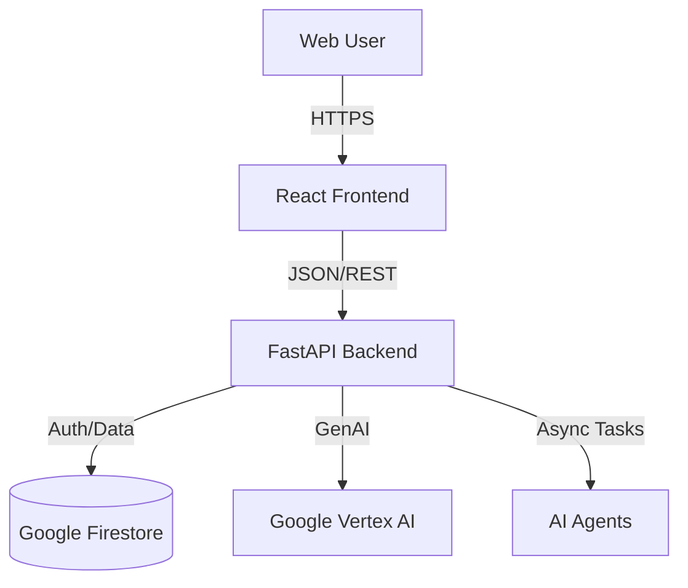

# ALI (Agentic Learning Intelligence) Platform

## Overview
ALI is a unified **Campaign Intelligence Engine** designed to orchestrate complex marketing workflows using advanced AI agents. The platform combines a high-performance **FastAPI** backend with a responsive **React** frontend to deliver brand analysis, campaign generation, and automated asset recycling.

## Key Features
- **Brand DNA Analysis**: Automated extraction of brand identity and values.
- **Campaign Orchestration**: Multi-agent system (`CampaignAgent`, `OrchestratorAgent`) for strategic planning.
- **Asset Recycling**: Intelligent transformation of existing assets into new formats.
- **Real-time Dashboard**: Interactive UI for managing campaigns and viewing results.

## Quick Start

### Prerequisites
- Docker & Docker Compose (Recommended)
- OR Python 3.10+ and Node.js 18+

### Running with Docker
*(If docker-compose is available)*
```bash
docker-compose up --build
```

### Manual Setup
1. **Backend**:
   ```bash
   cd ali-backend
   pip install -r requirements.txt
   uvicorn app.main:app --reload
   ```
2. **Frontend**:
   ```bash
   cd ali-frontend
   npm install
   npm run dev
   ```

## Documentation
Detailed technical documentation is available in the [docs](docs/) directory:

- [Backend Documentation](docs/backend.md): API architecture, services, and agent logic.
- [Frontend Documentation](docs/frontend.md): React setup, component structure, and build tools.
- [Deployment Guide](docs/deployment.md): Cloud Run deployment and CI/CD.

## Architecture


## Repository Structure
- `ali-backend/`: Python/FastAPI server code.
- `ali-frontend/`: React/Vite application code.
- `docs/`: Detailed project documentation.
- `cloudbuild.yaml`: Google Cloud Build configuration.
