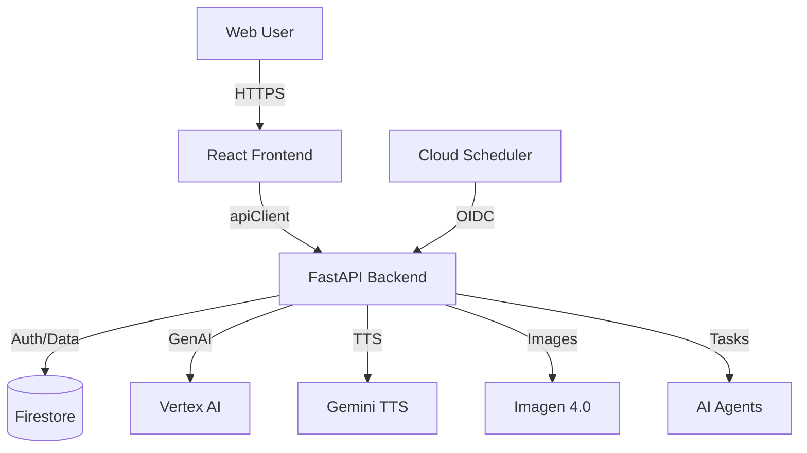

# ALI (Agentic Learning Intelligence) Platform

## Overview
ALI is a unified **Campaign Intelligence Engine** designed to orchestrate complex marketing workflows using advanced AI agents. The platform combines a high-performance **FastAPI** backend with a responsive **React** frontend to deliver brand analysis, campaign generation, tutorial creation, and brand monitoring.

## Key Features
- **Brand DNA Analysis**: AI extraction of brand identity, voice, and values
- **Campaign Orchestration**: Multi-agent system for strategic campaign planning
- **Tutorial Engine**: 4C/ID-based gamified tutorials with media generation
- **Brand Monitoring**: Real-time threat detection, competitive intelligence
- **Market Radar**: Market trend analysis and opportunity detection

## Quick Start

### Prerequisites
- Python 3.10+
- Node.js 18+
- GCP Service Account

### Backend
```bash
cd ali-backend
pip install -r requirements.txt
uvicorn app.main:app --reload
```

### Frontend
```bash
cd ali-frontend
npm install
npm run dev
```

## Documentation

### Core Documentation
| Document | Description |
|----------|-------------|
| [Backend Overview](docs/backend.md) | API architecture, agents, services |
| [Frontend Overview](docs/frontend.md) | React setup, components, pages |
| [Deployment Guide](docs/deployment.md) | Cloud Run deployment, CI/CD |

### Backend Subsystems
| Document | Description |
|----------|-------------|
| [Architecture](ali-backend/docs/architecture.md) | System design, retry mechanisms |
| [Brand Monitoring](ali-backend/docs/brand_monitoring.md) | Monitoring agents and API |
| [GCP Scheduler](ali-backend/docs/gcp_scheduler_setup.md) | Cloud Scheduler configuration |

### Frontend Guides
| Document | Description |
|----------|-------------|
| [API Client](ali-frontend/docs/api-client.md) | Type-safe HTTP client usage |
| [Endpoint Integration](ali-frontend/docs/integrate-endpoint-checklist.md) | Adding new endpoints |
| [Market Radar](ali-frontend/docs/market-radar.md) | Market intelligence UI |

### Tools
| Document | Description |
|----------|-------------|
| [Evidence Verifier](tools/README.md) | Offline evidence package validation |

## Architecture


## Repository Structure
```
ALI/
├── ali-backend/          # FastAPI server
│   ├── app/agents/       # AI agents
│   ├── app/services/     # Business services
│   └── docs/             # Backend docs
├── ali-frontend/         # React application
│   ├── src/lib/          # Core libraries
│   └── docs/             # Frontend docs
├── docs/                 # Project documentation
├── tools/                # CLI tools
└── cloudbuild.yaml       # CI/CD config
```

## License
Proprietary - All rights reserved.
