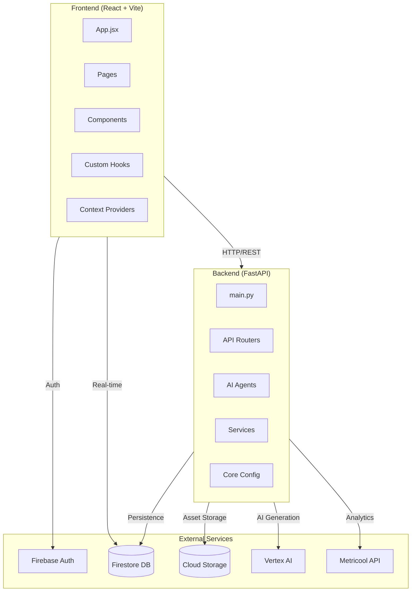
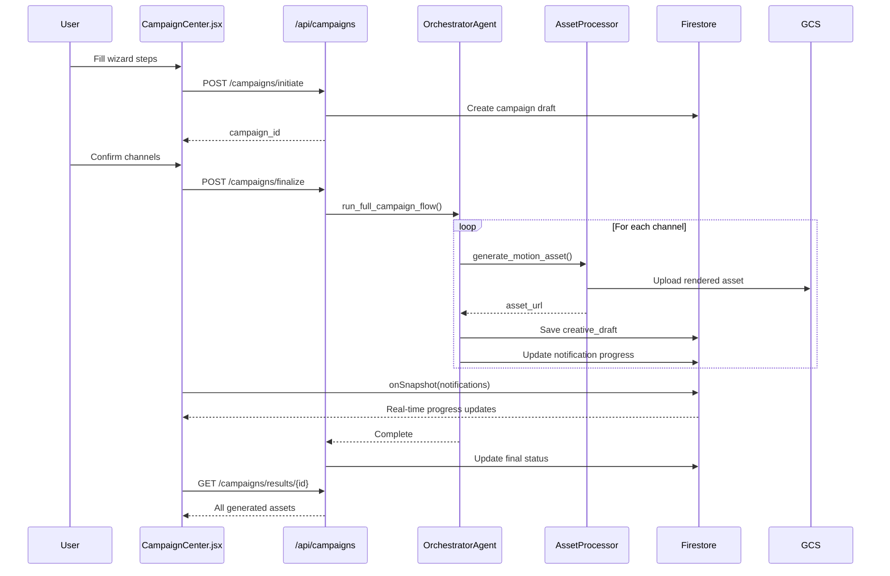
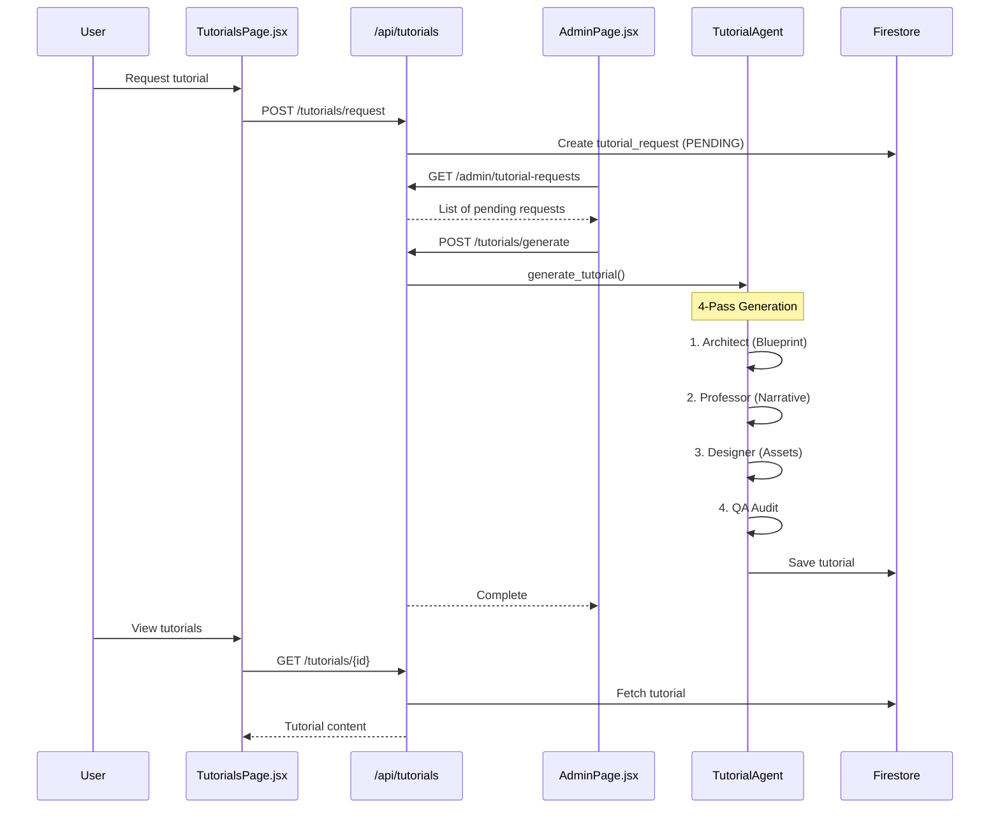
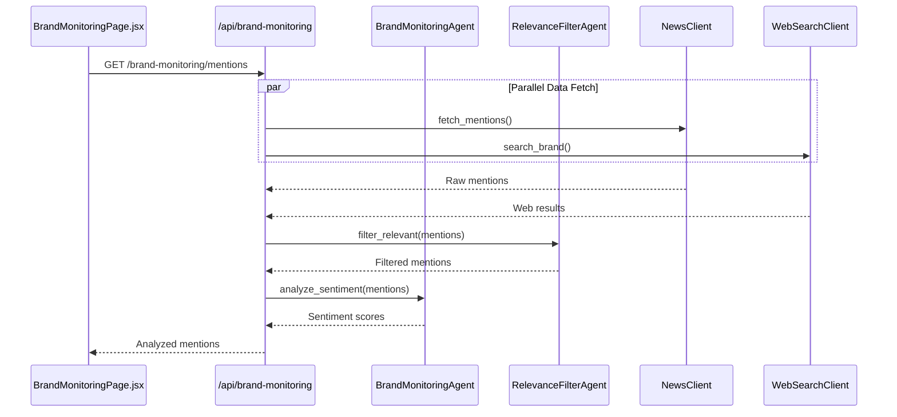
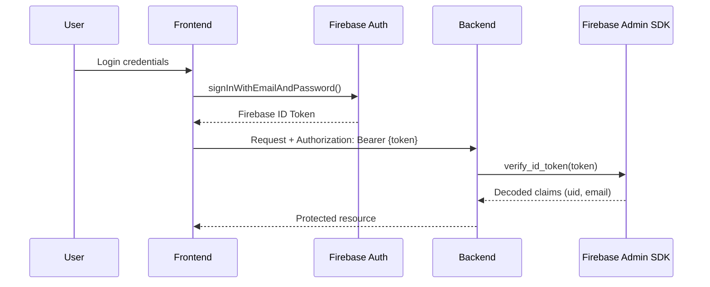

# ALI Platform - Complete Application Development Guide

This comprehensive guide documents the entire ALI Platform architecture, file structure, and how all components interact. Any developer reading this document will understand exactly what each file does and how it integrates with the rest of the application.

---

## Table of Contents

1. [Application Overview](#1-application-overview)
2. [Architecture Diagram](#2-architecture-diagram)
3. [Directory Structure](#3-directory-structure)
4. [Backend Deep Dive](#4-backend-deep-dive)
5. [Frontend Deep Dive](#5-frontend-deep-dive)
6. [Data Flow & API Mapping](#6-data-flow--api-mapping)
7. [Agent System](#7-agent-system)
8. [Service Layer](#8-service-layer)
9. [Security & Authentication](#9-security--authentication)
10. [Storage & Persistence](#10-storage--persistence)
11. [Testing Framework](#11-testing-framework)
12. [Deployment](#12-deployment)

---

## 1. Application Overview

The **ALI Platform** (Adaptive Learning Intelligence) is a comprehensive AI-powered marketing automation platform that provides:

- **Creative Studio**: Multi-channel campaign generation with AI-driven visual assets
- **Brand Monitoring**: Real-time brand mention tracking with sentiment analysis
- **Adaptive Learning Hub**: Personalized AI-generated marketing tutorials
- **Performance Dashboard**: Metricool-integrated analytics with AI forecasting
- **Admin Governance Center**: User provisioning and content approval workflows

### Tech Stack Summary

| Layer | Technology |
|-------|------------|
| **Frontend** | React 19, Vite, TailwindCSS, Firebase SDK |
| **Backend** | FastAPI (Python 3.10+), Uvicorn |
| **Database** | Google Cloud Firestore |
| **Storage** | Google Cloud Storage (GCS) |
| **AI/ML** | Google Vertex AI, Gemini, LangChain |
| **External APIs** | Metricool, NewsData.io, DuckDuckGo |
| **Deployment** | Google Cloud Run |

---

## 2. Architecture Diagram



---

## 3. Directory Structure

```
ALI/
├── ali-backend/                    # Backend API server
│   ├── app/
│   │   ├── agents/                 # AI Agent definitions (15 agents)
│   │   ├── core/                   # Core config, security, templates
│   │   ├── routers/                # API route controllers (20 routers)
│   │   ├── services/               # Business logic services (29 services)
│   │   ├── types/                  # Pydantic models & enums
│   │   ├── main.py                 # Application entry point
│   │   └── worker.py               # Background worker for heavy tasks
│   ├── tests/                      # Test suite (23 test files)
│   ├── data/                       # Static data files
│   ├── Dockerfile                  # Container configuration
│   └── requirements.txt            # Python dependencies
│
├── ali-frontend/                   # Frontend React application
│   ├── src/
│   │   ├── api/                    # API client configuration
│   │   ├── assets/                 # Static assets (images, fonts)
│   │   ├── components/             # Reusable UI components (12)
│   │   ├── context/                # React context providers (2)
│   │   ├── data/                   # Static data (countries, etc.)
│   │   ├── hooks/                  # Custom React hooks (1)
│   │   ├── pages/                  # Page components (14)
│   │   ├── services/               # Frontend services (2)
│   │   ├── types/                  # TypeScript-like type definitions
│   │   ├── App.jsx                 # Root component & routing
│   │   ├── main.jsx                # Application entry point
│   │   └── firebase.js             # Firebase client initialization
│   ├── Dockerfile                  # Frontend container
│   ├── nginx.conf                  # Production server config
│   └── package.json                # Node dependencies
│
├── docs/                           # Documentation
├── cloudbuild.yaml                 # Google Cloud Build config
└── README.md                       # Project readme
```

---

## 4. Backend Deep Dive

### 4.1 Entry Point: `app/main.py`

The FastAPI application entry point that orchestrates all backend functionality.

**Key Responsibilities:**
- Application initialization with lifespan management
- Middleware configuration (CORS, request size limits, security headers)
- Router registration with dynamic importing
- Health check endpoints for Cloud Run
- SIGTERM handler for graceful shutdown

**Middleware Stack:**
| Middleware | Purpose |
|------------|---------|
| `LimitRequestSizeMiddleware` | Enforces 5MB request payload limit |
| `SecurityHeadersMiddleware` | Adds CSP, X-Content-Type-Options headers |
| `CORSMiddleware` | Handles cross-origin requests |

**Router Registration Map:**

| Prefix | Router File | Tags | Description |
|--------|-------------|------|-------------|
| `/api/auth` | `auth.py` | Auth | User authentication & profile |
| `/api/dashboard` | `dashboard.py` | Dashboard | Analytics & performance data |
| `/api/notifications` | `notifications.py` | Notifications | User notification management |
| `/api` | `integration.py` | Integrations | Third-party integrations |
| `/api/jobs` | `jobs.py` | Jobs | Background job management |
| `/api/assessments` | `assessments.py` | Assessments | Skill assessments & quizzes |
| `/api/publisher` | `publisher.py` | Publisher | Content publishing |
| `/api/creatives` | `creatives.py` | Creatives | Draft & asset management |
| `/api/campaigns` | `campaigns.py` | Campaigns | Campaign orchestration |
| `/api/assets` | `assets.py` | Assets | Asset processing |
| `/api/saga-map` | `saga_map.py` | Saga Map | Visual roadmap navigation |
| `/api/ai/web` | `ai_web.py` | AI Web | Web research & AI queries |
| `/api/brand-monitoring` | `brand_monitoring.py` | Brand Monitoring | Mention tracking |
| `/api/tutorials` | `tutorials.py` | Tutorials | Learning content |
| `/api/admin` | `admin.py` | Admin | Admin governance |
| `/api/execution` | `execution.py` | Execution | Content execution |
| `/api/metricool-client` | `metricool_client.py` | Metricool | Social analytics |
| `/api/monitoring` | `monitoring.py` | Monitoring | System health |
| `/internal` | `scheduler.py` | Scheduler | Background scheduling |
| `/api/maintenance` | `maintenance.py` | Maintenance | System maintenance |

---

### 4.2 Core Module: `app/core/`

#### `security.py`
**Purpose:** Firebase Admin SDK initialization and authentication utilities.

**Key Components:**
- `initialize_firebase()` - Singleton pattern for Firebase initialization
- `verify_token()` - FastAPI dependency for JWT validation
- `get_current_user_id()` - Extracts UID from verified token
- `db` - Global Firestore client instance

**Authentication Flow:**
```
1. Frontend sends Firebase ID token in Authorization header
2. verify_token() validates token via Firebase Admin SDK
3. Returns decoded token with user claims
4. Routers use Depends(verify_token) for protection
```

#### `config.py`
**Purpose:** Environment variable management and application configuration.

#### `templates.py` (75KB - Major File)
**Purpose:** Master Motion Templates Library for visual asset generation.

**Key Components:**
- `FONT_PAIRINGS` - Brand-specific typography configurations
- `LAYOUT_VARIANTS` - Layout variant configurations (hero-center, top-banner, etc.)
- `CHANNEL_LAYOUT_PREFERENCE` - Per-channel layout recommendations
- Template functions for generating HTML5/GSAP animations
- Film grain, particles, and RGB shift effects

**Template Styles:**
| Style | Description | Best For |
|-------|-------------|----------|
| `luxury` | Playfair Display + Lato | Premium brands |
| `cyber` | Rajdhani + Oswald | Tech companies |
| `editorial` | DM Serif Display + Cormorant | Publications |
| `minimal` | Inter + Roboto Flex | Clean designs |
| `pop` | Anton + Roboto | Bold campaigns |

---

### 4.3 Routers: `app/routers/`

#### `auth.py`
**Endpoints:**
- `GET /api/auth/me` - Get current user profile
- `POST /api/auth/logout` - Backend logout handling

#### `dashboard.py`
**Endpoints:**
- `GET /api/dashboard/overview` - Metricool analytics + AI predictions
- `GET /api/dashboard/next-actions` - Prioritized task list

**Data Sources:** Metricool API, Firestore (drafts, tutorials)

#### `campaigns.py`
**Endpoints:**
- `POST /api/campaigns/initiate` - Start new campaign wizard
- `POST /api/campaigns/finalize` - Trigger asset generation
- `GET /api/campaigns/results/{id}` - Get generated results
- `POST /api/campaigns/resume/{id}` - Resume interrupted campaign
- `GET /api/campaigns/checkpoint/{id}` - Check for interrupted sessions
- `POST /api/campaigns/recycle` - Repurpose existing assets
- `POST /api/campaigns/regenerate-channel` - Regenerate single channel
- `POST /api/campaigns/draft` - Save wizard draft
- `GET /api/campaigns/drafts` - Get user's wizard drafts
- `DELETE /api/campaigns/draft/{id}` - Delete wizard draft

**Connected Services:** OrchestratorAgent, CampaignAgent, AssetProcessor

#### `creatives.py`
**Endpoints:**
- `GET /api/creatives/drafts` - Fetch pending/draft creatives
- `GET /api/creatives/published` - Fetch approved creatives
- `POST /api/creatives/publish/{id}` - Approve & publish draft
- `GET /api/creatives/download/{id}` - Download single asset
- `GET /api/creatives/export/{campaign_id}` - Export ZIP of all assets
- `DELETE /api/creatives/{id}` - Delete creative
- `POST /api/creatives/regenerate/{id}` - Regenerate failed creative

#### `tutorials.py`
**Endpoints:**
- `POST /api/tutorials/request` - Submit tutorial request (user)
- `POST /api/tutorials/generate` - Generate tutorial (admin only)
- `GET /api/tutorials/suggestions` - Get AI-powered topic suggestions
- `GET /api/tutorials/requests` - Get user's tutorial requests
- `GET /api/tutorials/{id}` - Get tutorial details
- `POST /api/tutorials/{id}/complete` - Mark tutorial complete
- `DELETE /api/tutorials/{id}` - Soft delete tutorial
- `DELETE /api/tutorials/admin/{id}` - Hard delete (admin)
- `GET /api/tutorials/{id}/media-health` - Validate media URLs

**Connected Services:** TutorialAgent, JobRunner, ImageAgent, AudioAgent

#### `brand_monitoring.py`
**Endpoints:**
- `GET /api/brand-monitoring/mentions` - Get brand mentions
- `POST /api/brand-monitoring/crisis-response` - Generate PR response
- `GET /api/brand-monitoring/settings` - Get monitoring settings
- `POST /api/brand-monitoring/settings` - Update settings
- `GET /api/brand-monitoring/knowledge-packs` - Get knowledge packs

**Connected Services:** BrandMonitoringAgent, RelevanceFilterAgent, NewsClient, WebSearchClient

#### `admin.py` (48KB - Major File)
**Purpose:** Comprehensive admin governance center.

**Endpoint Groups:**
- Tutorial request management
- User provisioning
- Content approval workflows
- System analytics
- Maintenance tasks

---

### 4.4 Types: `app/types/`

#### `tutorial_lifecycle.py`
**Enums:**
- `TutorialStatus`: DRAFT, PENDING, PUBLISHED, FAILED, ARCHIVED
- `TutorialRequestStatus`: PENDING, APPROVED, REJECTED, GENERATING, COMPLETED

#### `course_manifest.py`
**Purpose:** Pydantic models for course structure and metadata.

---

## 5. Frontend Deep Dive

### 5.1 Entry Point: `src/main.jsx`

Renders the root App component into the DOM.

### 5.2 Root Component: `src/App.jsx`

**Responsibilities:**
- Global error handling (window.onerror, unhandledrejection)
- Provider hierarchy setup
- Route definitions
- Layout component with Sidebar

**Provider Hierarchy:**
```jsx
<ThemeProvider>
  <AuthProvider>
    <NotificationProvider>
      <Router>
        {/* Routes */}
      </Router>
    </NotificationProvider>
  </AuthProvider>
</ThemeProvider>
```

**Route Structure:**

| Route | Component | Protection | Description |
|-------|-----------|------------|-------------|
| `/register` | `RegisterPage` | Public | User registration |
| `/login` | `LoginPage` | Public | User login |
| `/dashboard` | `DashboardPage` | Protected | Performance analytics |
| `/onboarding` | `BrandOnboarding` | Protected | Brand DNA setup |
| `/integrations` | `IntegrationsPage` | Protected | Third-party connections |
| `/campaign-center` | `CampaignCenter` | Protected | Creative Studio |
| `/campaign-center/:id` | `CampaignCenter` | Protected | Campaign with ID |
| `/brand-monitoring` | `BrandMonitoringPage` | Protected | Mention tracking |
| `/admin` | `AdminPage` | Protected + Admin | Governance center |
| `/quiz/hft` | `HFTPage` | Protected | HFT assessment |
| `/quiz/marketing` | `MarketingTestPage` | Protected | Marketing quiz |
| `/quiz/eq` | `EQTestPage` | Protected | EQ assessment |
| `/tutorials` | `TutorialsPage` | Protected | Learning hub |
| `/tutorials/:id` | `TutorialDetailsPage` | Protected | Tutorial viewer |

### 5.3 Pages: `src/pages/`

#### `CampaignCenter.jsx` (137KB - Largest File)
**Purpose:** Multi-channel campaign orchestration hub (Creative Studio).

**Key Features:**
- 4-step campaign wizard
- Real-time generation progress via Firestore
- Asset review and approval workflow
- Remix and recycling functionality
- Draft persistence and resume capability
- Channel-specific asset previews

**State Management:**
- `wizardStep` - Current wizard stage (0-3)
- `selectedChannels` - User-selected platforms
- `results` - Generated creative assets
- `generating` - Generation progress tracking
- `wizardDrafts` - Saved incomplete wizards

**Wizard Steps:**
1. **Goal Definition** - Campaign objective and theme
2. **Channel Selection** - Target platforms
3. **AI Questions** - Dynamic interview
4. **Generation** - AI asset creation

#### `DashboardPage.jsx`
**Purpose:** Performance analytics and AI predictions.

**Features:**
- Metricool data visualization (Chart.js)
- Platform-specific metrics breakdown
- AI-powered CPC/CTR forecasts
- Next actions recommendations
- Recent campaigns summary

#### `BrandMonitoringPage.jsx`
**Purpose:** Brand reputation monitoring and crisis management.

**Features:**
- Real-time mention scanning
- Sentiment analysis visualization
- Crisis response generation
- Knowledge pack management
- Web research interface

#### `TutorialsPage.jsx`
**Purpose:** Adaptive Learning Hub main view.

**Features:**
- Tutorial request submission
- Active/completed lesson tracking
- Saga Map roadmap navigation
- AI topic suggestions

#### `TutorialDetailsPage.jsx`
**Purpose:** Tutorial content viewer and player.

**Features:**
- Markdown content rendering
- Media playback (video, audio)
- Quiz/assessment integration
- Progress tracking
- Completion workflow

#### `AdminPage.jsx` (61KB)
**Purpose:** Admin governance and user provisioning.

**Features:**
- Tutorial request approval/rejection
- User management
- Content moderation
- System analytics
- Maintenance controls

#### `BrandOnboarding.jsx`
**Purpose:** Initial brand DNA setup wizard.

#### `IntegrationsPage.jsx`
**Purpose:** Third-party integration management (Metricool, etc.).

#### `LoginPage.jsx` / `RegisterPage.jsx`
**Purpose:** Firebase authentication flows.

#### Assessment Pages (`HFTPage.jsx`, `MarketingTestPage.jsx`, `EQTestPage.jsx`)
**Purpose:** Skill assessment quizzes that feed into tutorial personalization.

### 5.4 Components: `src/components/`

#### `Sidebar.jsx`
**Purpose:** Main navigation sidebar.

**Features:**
- Collapsible mobile design
- Active route highlighting
- User profile display
- Quick-access navigation

#### `NotificationCenter.jsx`
**Purpose:** Real-time notification display.

**Integration:** Listens to Firestore `users/{uid}/notifications` collection.

#### `CarouselViewer.jsx`
**Purpose:** Multi-slide asset carousel for campaign review.

**Props:**
- `slides` - Array of slide URLs
- `onApprove`, `onReject` - Action handlers

#### `SagaMapNavigator.jsx`
**Purpose:** Visual node-based learning roadmap.

**Features:**
- Course module visualization
- Progress tracking
- Interactive navigation

#### `TutorialPlayer.jsx`
**Purpose:** Reusable tutorial content renderer.

#### `StrategyKanban.jsx`
**Purpose:** Kanban-style strategy board.

#### `BrandMonitoringSection.jsx` (50KB)
**Purpose:** Core brand monitoring interactive UI (extracted from page for modularity).

#### `GameBlock.jsx`
**Purpose:** Interactive game/quiz rendering for tutorials.

#### `MermaidBlock.jsx`
**Purpose:** Mermaid diagram rendering for tutorials.

#### `ProtectedRoute.jsx`
**Purpose:** Route guard for authenticated routes.

#### `ErrorBoundary.jsx`
**Purpose:** React error boundary for graceful error handling.

### 5.5 Context Providers: `src/context/`

#### `ThemeContext.jsx`
**Purpose:** Dark/light mode management.

**Exports:**
- `ThemeProvider` - Context provider component
- `useTheme()` - Hook for theme access

#### `NotificationContext.jsx`
**Purpose:** Global notification state.

**Exports:**
- `NotificationProvider` - Context provider
- `useNotifications()` - Hook for notification access

### 5.6 Hooks: `src/hooks/`

#### `useAuth.jsx`
**Purpose:** Authentication state management.

**Returns:**
- `currentUser` - Firebase user object
- `loading` - Auth loading state
- `userProfile` - Backend user profile
- `logout()` - Logout function
- `refreshProfile()` - Refresh user data

### 5.7 API Configuration: `src/api/`

#### `axiosInterceptor.js`
**Purpose:** Configured Axios instance with auth interceptors.

**Features:**
- Automatic Bearer token injection
- Base URL configuration
- 401 auto-logout

#### `api_config.js`
**Purpose:** API URL configuration based on environment.

### 5.8 Services: `src/services/`

#### `Logger.js`
**Purpose:** Frontend logging service for error tracking.

#### `webResearchApi.js`
**Purpose:** Web research API client.

### 5.9 Firebase Client: `src/firebase.js`
**Purpose:** Firebase SDK initialization.

**Exports:**
- `auth` - Firebase Auth instance
- `db` - Firestore instance
- `app` - Firebase app instance

---

## 6. Data Flow & API Mapping

### 6.1 Campaign Generation Flow



### 6.2 Tutorial Generation Flow



### 6.3 Brand Monitoring Flow



---

## 7. Agent System

### 7.1 Agent Architecture

All agents inherit from `BaseAgent` in `app/agents/base_agent.py`.

| Agent | File | Purpose | Key Methods |
|-------|------|---------|-------------|
| **OrchestratorAgent** | `orchestrator_agent.py` | Central campaign coordinator | `run_full_campaign_flow()`, `_save_draft_immediately()` |
| **CampaignAgent** | `campaign_agent.py` | Campaign strategy & blueprint | `generate_blueprint()`, `interview_user()` |
| **BrandAgent** | `brand_agent.py` | Brand DNA analysis | `analyze_brand()`, `extract_dna()` |
| **ImageAgent** | (service) | AI image generation | `generate_image()`, `upscale()` |
| **CriticAgent** | `critic_agent.py` | Content quality control | `review_content()`, `suggest_improvements()` |
| **RelevanceFilterAgent** | `relevance_filter_agent.py` | Content relevance filtering | `filter_mentions()`, `score_relevance()` |
| **BrandMonitoringAgent** | `brand_monitoring_agent.py` | Sentiment analysis | `analyze_sentiment()`, `generate_crisis_response()` |
| **TutorialAgent** | `tutorial_agent.py` | Educational content generation | `generate_tutorial()`, `generate_curriculum_blueprint()` |
| **StrategyAgent** | `strategy_agent.py` | Marketing strategy development | `create_strategy()` |
| **TroubleshootingAgent** | `troubleshooting_agent.py` | System diagnostics | `diagnose_issue()`, `suggest_fix()` |
| **MaintenanceAgent** | `maintenance_agent.py` | System health | `run_maintenance()` |
| **RecyclerAgent** | `recycler_agent.py` | Asset repurposing | `recycle_asset()` |

### 7.2 OrchestratorAgent Deep Dive

The `OrchestratorAgent` (63KB) is the central coordinator for multi-channel campaign generation.

**Key Features:**
- Checkpoint/resume system for interrupted generations
- Progressive draft saving (prevents "85% hang")
- AI image caching to avoid redundant API calls
- Graceful shutdown handling (SIGTERM)
- Multi-format support per channel

**Checkpoint System:**
```python
# Save checkpoint after each asset
_save_checkpoint(uid, campaign_id, checkpoint_data)

# Load checkpoint on resume
checkpoint = _load_checkpoint(campaign_id)

# Mark channel complete
_mark_channel_complete(campaign_id, channel, format_label)
```

### 7.3 TutorialAgent Deep Dive

The `TutorialAgent` (44KB) implements a 4-pass generation pipeline:

1. **Architect Pass** - Curriculum blueprint using 4C/ID theory
2. **Professor Pass** - Section narrative writing
3. **Designer Pass** - Asset generation (images, audio, video)
4. **QA Pass** - Quality audit against blueprint

---

## 8. Service Layer

### 8.1 Service Catalog

| Service | File | Purpose | External Dependencies |
|---------|------|---------|----------------------|
| **AssetProcessor** | `asset_processor.py` | Visual engine for HTML/video rendering | Playwright, GSAP, GCS |
| **VeoClient** | `veo_client.py` | Google Veo video generation | Vertex AI |
| **MetricoolClient** | `metricool_client.py` | Social media analytics | Metricool API |
| **LLMFactory** | `llm_factory.py` | AI model selection | Vertex AI, Gemini |
| **BigQueryService** | `bigquery_service.py` | Large-scale analytics | BigQuery |
| **CloudTasksOrchestrator** | `cloud_tasks_orchestrator.py` | Async task management | Cloud Tasks |
| **SagaMapService** | `saga_map_service.py` | Visual roadmap management | Firestore |
| **KnowledgePacksService** | `knowledge_packs_service.py` | Industry knowledge injection | Firestore, GCS |
| **CanonicalAdMapper** | `canonical_ad_mapper.py` | Platform-specific ad formatting | - |
| **ClaimsVerifier** | `claims_verifier.py` | Content compliance auditing | LLM |
| **AudioAgent** | `audio_agent.py` | Text-to-speech generation | Google TTS |
| **ImageAgent** | `image_agent.py` | AI image generation | Imagen 4.0 |
| **ResearchService** | `research_service.py` | Market research | Web search |
| **WebSearchClient** | `web_search_client.py` | Web information retrieval | DuckDuckGo |
| **NewsClient** | `news_client.py` | News aggregation | NewsData.io |
| **GCSService** | `gcs_service.py` | Cloud Storage operations | GCS |
| **CryptoService** | `crypto_service.py` | Encryption utilities | - |
| **DataEngine** | `data_engine.py` | Data transformation | - |
| **Forecasting** | `forecasting.py` | AI predictions | LLM |
| **Governance** | `governance.py` | Policy enforcement | - |
| **Ingestion** | `ingestion.py` | Data import | - |
| **JobRunner** | `job_runner.py` | Background job execution | - |
| **KnowledgeService** | `knowledge_service.py` | Knowledge retrieval | - |
| **MaintenanceService** | `maintenance_service.py` | System cleanup | Firestore, GCS |
| **PerformanceLogger** | `performance_logger.py` | Metrics logging | - |
| **QCRubric** | `qc_rubric.py` | Quality control scoring | - |
| **WindsorClient** | `windsor_client.py` | Attribution tracking | Windsor API |
| **AIStudio** | `ai_studio.py` | AI creative services | Vertex AI |
| **AIServiceClient** | `ai_service_client.py` | AI service wrapper | - |

### 8.2 AssetProcessor Deep Dive

The `AssetProcessor` (66KB) is the visual rendering engine.

**Key Features:**
- Browser Pool pattern (singleton pre-warmed Chromium instances)
- Background removal via rembg or Cloud Vision
- Smart cropping with focal point detection
- Color palette extraction
- GSAP HTML5 animation rendering
- Video transcoding to MP4

**Browser Pool Pattern:**
```python
class BrowserPool:
    """Singleton pool of pre-warmed Chromium browser instances."""
    
    @classmethod
    async def acquire(cls):
        """Get a browser from the pool (or create new)."""
    
    @classmethod
    async def release(cls, browser):
        """Return browser to pool for reuse."""
    
    @classmethod
    async def warmup(cls, count=2):
        """Pre-warm browsers on startup."""
```

### 8.3 MetricoolClient Deep Dive

The `MetricoolClient` (26KB) provides social media analytics integration.

**Key Methods:**
- `get_all_brands()` - List all agency brands
- `get_brand_status(blog_id)` - Check brand configuration
- `normalize_media(url)` - Upload media to Metricool
- `publish_post()` - Schedule social post
- `get_analytics(blog_id, days)` - Fetch performance data
- `get_dashboard_snapshot(blog_id)` - Holistic performance view

---

## 9. Security & Authentication

### 9.1 Authentication Flow



### 9.2 Admin Access Control

Admin access is controlled via email allowlist:

```python
# Backend: app/routers/tutorials.py
ADMIN_EMAILS = [
    email.strip().lower()
    for email in os.getenv("ADMIN_EMAILS", "").split(",")
    if email.strip()
]

def _require_admin(user: dict, action: str):
    """Verify user has admin privileges."""
    if not user.get("is_admin") and user.get("email", "").lower() not in ADMIN_EMAILS:
        raise HTTPException(403, f"Admin required for: {action}")
```

```javascript
// Frontend: App.jsx
const AdminRoute = ({ children }) => {
    const { currentUser } = useAuth();
    const ADMIN_EMAILS = ["manoliszografos@gmail.com"];
    
    if (!currentUser?.email || !ADMIN_EMAILS.includes(currentUser.email)) {
        return <Navigate to="/dashboard" replace />;
    }
    return children;
};
```

### 9.3 Security Middleware

```python
class SecurityHeadersMiddleware:
    """Adds security headers to all responses."""
    
    async def dispatch(self, request, call_next):
        response = await call_next(request)
        response.headers["X-Content-Type-Options"] = "nosniff"
        response.headers["X-Frame-Options"] = "DENY"
        response.headers["Content-Security-Policy"] = "default-src 'self'"
        response.headers["Cache-Control"] = "no-store"
        return response
```

---

## 10. Storage & Persistence

### 10.1 Firestore Collections

| Collection Path | Purpose | Key Fields |
|-----------------|---------|------------|
| `users/{uid}` | User profiles | `email`, `brand_dna`, `skill_matrix` |
| `users/{uid}/notifications/{id}` | Real-time notifications | `progress`, `status`, `link` |
| `users/{uid}/creative_drafts/{id}` | Generated creative assets | `channel`, `status`, `asset_url` |
| `users/{uid}/campaign_drafts/{id}` | Wizard state persistence | `step`, `goal`, `channels` |
| `users/{uid}/tutorials/{id}` | User-specific tutorials | `topic`, `sections`, `progress` |
| `users/{uid}/tutorial_requests/{id}` | Tutorial requests | `topic`, `status` |
| `global_tutorials/{id}` | Public tutorial content | `topic`, `sections`, `status` |
| `users/{uid}/brand_monitoring/{id}` | Monitoring settings | `keywords`, `competitors` |
| `users/{uid}/knowledge_packs/{id}` | Knowledge bases | `facts`, `citations` |
| `generation_checkpoints/{campaign_id}` | Resume checkpoints | `completed_channels`, `ai_image_cache` |

### 10.2 Google Cloud Storage

**Bucket Structure:**
```
ali-platform-prod-73019.firebasestorage.app/
├── assets/
│   └── {uid}/
│       └── {campaign_id}/
│           └── {channel}/
│               ├── {format}.png
│               └── {format}.mp4
├── tutorials/
│   └── {uid}/
│       └── {tutorial_id}/
│           ├── images/
│           ├── audio/
│           └── video/
└── brand/
    └── {uid}/
        └── logo.png
```

### 10.3 Two-Tier Persistence Strategy

**Tier A: Wizard Drafts (Input Phase)**
- Auto-saved every 3 seconds via frontend debounce
- Stored in `campaign_drafts` subcollection
- Enables resume of incomplete wizards

**Tier B: Generated Drafts (Execution Phase)**
- Progressive saves after each asset generation
- Prevents "85% hang" if instance terminates
- Checkpoint system for full resumability

---

## 11. Testing Framework

### 11.1 Test Files Overview

| Test File | Purpose |
|-----------|---------|
| `test_agents.py` | Agent unit tests |
| `test_brand_monitoring.py` | Brand monitoring integration |
| `test_campaign_intent.py` | Campaign intent extraction |
| `test_governance_services.py` | Governance policy tests |
| `test_integration.py` | Cross-component integration |
| `test_media_agents.py` | Media generation tests |
| `test_metricool_mapping.py` | Metricool API mapping |
| `test_relevance_filter.py` | Relevance filtering tests |
| `test_routers.py` | API endpoint tests |
| `test_templates.py` | Template rendering tests |
| `verify_full_stack.py` | Full stack verification |
| `verify_campaign_flow.py` | Campaign flow E2E |
| `verify_asset_generation.py` | Asset generation E2E |
| `verify_tutorial_logic.py` | Tutorial generation E2E |
| `chaos_test.py` | Resilience testing |
| `static_analysis.py` | Code hygiene checks |
| `stress_test_tutorials.py` | Load testing |

### 11.2 Running Tests

```bash
# From ali-backend directory
cd ali-backend

# Run all tests
pytest

# Run specific test file
pytest tests/test_agents.py

# Run with coverage
pytest --cov=app tests/

# Run chaos tests
pytest tests/chaos_test.py -v
```

---

## 12. Deployment

### 12.1 Cloud Build Configuration

The `cloudbuild.yaml` orchestrates deployment to Cloud Run:

```yaml
# Key configurations
_BACKEND_MEMORY: "2Gi"
_BACKEND_CPU: "2"
_BACKEND_TIMEOUT: "900s"  # 15 minutes for video rendering
_MIN_INSTANCES: "1"       # Prevent cold starts
```

### 12.2 Docker Images

**Backend Dockerfile:**
```dockerfile
FROM python:3.10-slim
# Includes: ffmpeg, fonts, Playwright dependencies
RUN pip install -r requirements.txt
CMD ["uvicorn", "app.main:app", "--host", "0.0.0.0", "--port", "$PORT"]
```

**Frontend Dockerfile:**
```dockerfile
FROM node:18 AS builder
RUN npm run build

FROM nginx:alpine
COPY --from=builder /app/dist /usr/share/nginx/html
COPY nginx.conf /etc/nginx/conf.d/default.conf
```

### 12.3 Environment Variables

**Required Backend Variables:**
- `GOOGLE_APPLICATION_CREDENTIALS` - Service account path
- `PROJECT_ID` - GCP project ID
- `METRICOOL_USER_TOKEN` - Metricool API token
- `METRICOOL_USER_ID` - Metricool user ID
- `ADMIN_EMAILS` - Comma-separated admin emails
- `ENABLE_VEO_VIDEO` - Toggle Veo video generation

**Required Frontend Variables:**
- `VITE_API_URL` - Backend API URL
- Firebase configuration (baked into `firebase.js`)

---

## Quick Reference: File → Function Mapping

### When to Modify Each File

| If you need to... | Modify these files |
|-------------------|-------------------|
| Add new API endpoint | `app/routers/{feature}.py`, register in `main.py` |
| Add new AI capability | `app/agents/{agent}.py`, may need new service |
| Change visual templates | `app/core/templates.py` |
| Add new frontend page | `src/pages/{Page}.jsx`, add route in `App.jsx` |
| Modify authentication | `app/core/security.py`, `src/hooks/useAuth.jsx` |
| Add new component | `src/components/{Component}.jsx` |
| Change storage logic | `app/services/gcs_service.py`, Firestore in routers |
| Add external integration | New service in `app/services/`, new router if needed |
| Modify campaign flow | `app/agents/orchestrator_agent.py`, `CampaignCenter.jsx` |
| Add tutorial features | `app/agents/tutorial_agent.py`, `app/routers/tutorials.py` |
| Change brand monitoring | `app/agents/brand_monitoring_agent.py`, `BrandMonitoringSection.jsx` |

---

## Appendix: Common Development Tasks

### A1. Adding a New Campaign Channel

1. Update `app/routers/creatives.py` - Add to `KNOWN_CHANNELS`
2. Update `app/core/templates.py` - Add layout preferences
3. Update `app/agents/orchestrator_agent.py` - Add channel handling
4. Update `src/pages/CampaignCenter.jsx` - Add to channel selector UI

### A2. Adding a New Tutorial Type

1. Update `app/types/course_manifest.py` - Add new type
2. Update `app/agents/tutorial_agent.py` - Handle new type generation
3. Update `src/pages/TutorialDetailsPage.jsx` - Render new type

### A3. Adding a New Admin Feature

1. Add endpoint in `app/routers/admin.py`
2. Add UI in `src/pages/AdminPage.jsx`
3. Update admin email list if new permissions needed

### A4. Debugging Generation Issues

1. Check `generation_checkpoints/{campaign_id}` in Firestore
2. Check `users/{uid}/notifications/{campaign_id}` for progress
3. Review Cloud Run logs for agent errors
4. Use `tests/verify_campaign_flow.py` to reproduce

---

*Document Version: 1.0*  
*Last Updated: January 2026*  
*Compatible With: ALI Platform v4.0+*
